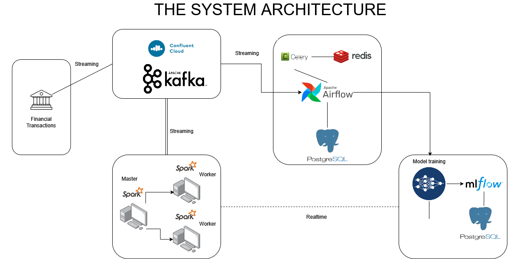

#  Data Engineering & Fraud Detection with Machine Learning

This project presents a modular, end-to-end pipeline for detecting fraudulent transactions using machine learning. It integrates data ingestion, preprocessing, model training, and inference within a scalable, containerized architecture.

## 🚀 Project Overview

The pipeline encompasses the following components:

* **Data Ingestion**: Simulates real-time transaction data using a producer module.
* **Data Orchestration**: Utilizes Apache Airflow for scheduling and managing data workflows.
* **Model Training & Tracking**: Employs MLflow to train models and track experiments.
* **Model Inference**: Applies trained models to incoming data for fraud prediction.
* **Containerization**: Leverages Docker and Docker Compose for environment setup and service orchestration.

## 🧱 Project Structure

```
├── airflow/             # Airflow configurations and DAGs
├── dags/                # Airflow DAG definitions
├── inference/           # Scripts for model inference
├── logs/                # Log files
├── mlflow/              # MLflow tracking server setup
├── models/              # Saved machine learning models
├── producer/            # Data producer scripts
├── .env                 # Environment variables
├── config.yaml          # Configuration file
├── docker-compose.yml   # Docker Compose configuration
├── init-multiple-dbs.sh # Script to initialize multiple databases
└── wait-for-it.sh       # Script to wait for services to be ready
```

## 🛠️ Getting Started

### Prerequisites

Ensure you have the following installed:

* [Docker](https://www.docker.com/)
* [Docker Compose](https://docs.docker.com/compose/)

### Installation

1. **Clone the repository**:

```bash
git clone https://github.com/velisen/data_engineering_fraud_detection_machine_learning.git
cd data_engineering_fraud_detection_machine_learning
```

2. **Set up environment variables**:

Create a `.env` file in the root directory and define necessary environment variables as per your configuration.

3. **Build and start the services**:

```bash
docker-compose up --build
```

This command will build the Docker images and start all services, including Airflow, MLflow, and the data producer.

## 📈 Usage

* **Access Airflow**: Navigate to `http://localhost:8080` to access the Airflow web interface.
* **Access MLflow**: Navigate to `http://localhost:5000` to access the MLflow tracking server.
* **Monitor Logs**: Logs are stored in the `logs/` directory for debugging and monitoring purposes.

## 📄 Configuration

The `config.yaml` file contains configuration settings for the project, including paths, model parameters, and other settings. Modify this file to suit your specific requirements.


